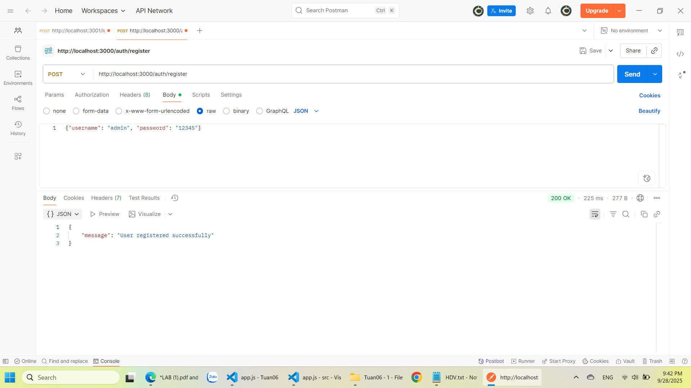
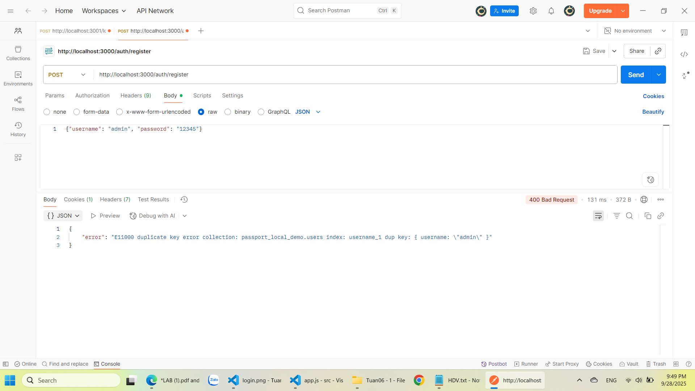
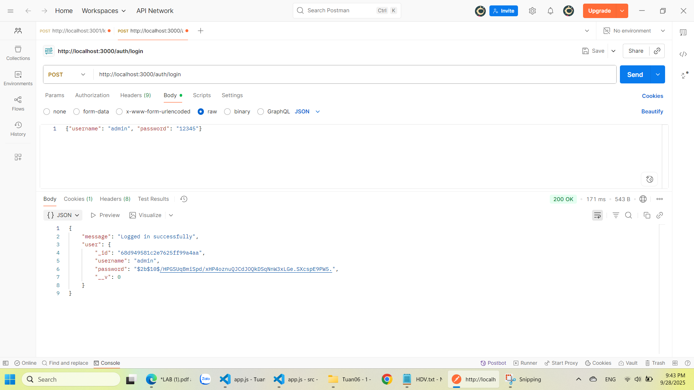
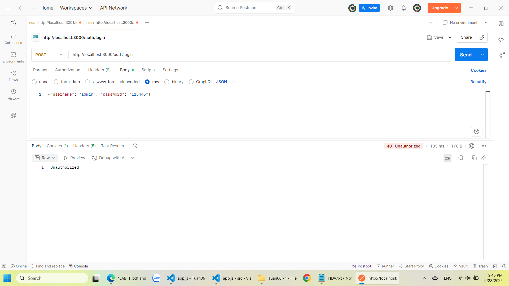
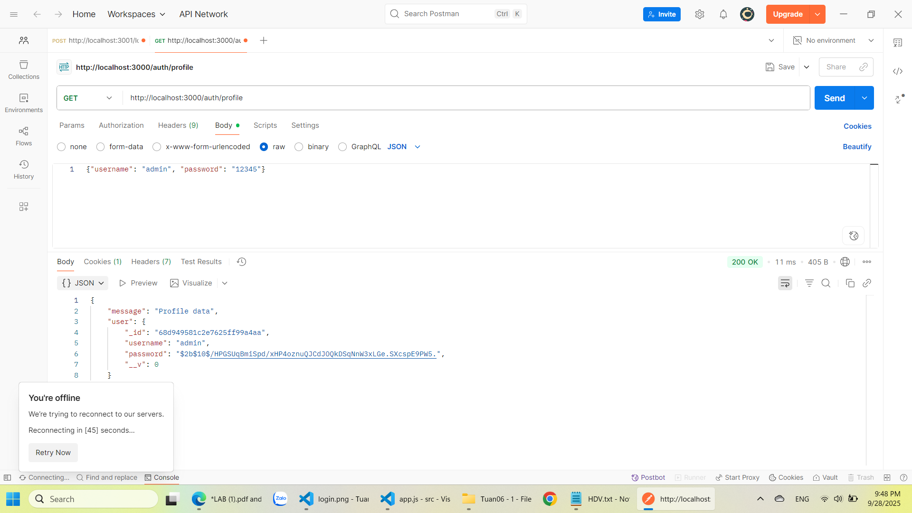
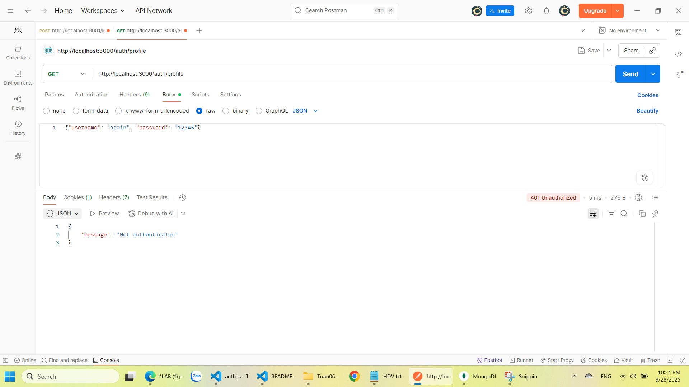
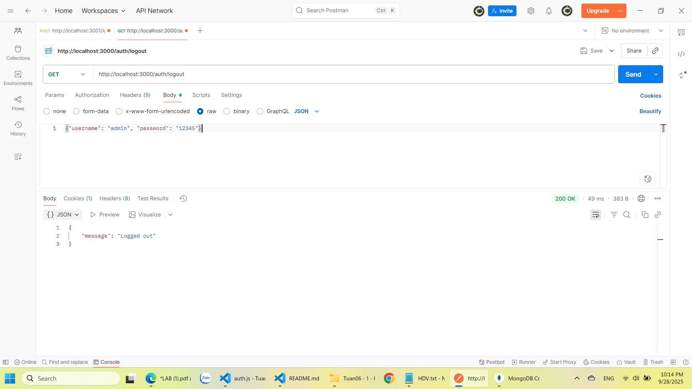

# Local Passport Authentication (LAB: Security in NodeJS)

## 1. Cách chạy dự án

### Cài đặt thư viện
Chạy lệnh sau để cài tất cả dependencies:
```bash
npm install
```
### 2. Khởi động MongoDB
### 3. Start servers:
```bash
node app.js
```
### Register
POST `http://localhost:3000/auth/register`
Body JSON:
```json
{ "username": "admin", "password": "12345" }
```
Expected: User registered successfully.  

Fail case: "error": "E11000 duplicate key error collection: ... "


### LOGIN
POST `http://localhost:3000/auth/login`
#### Expected:
Body JSON:
```json
{ "username": "admin", "password": "12345" }
```
Expected: Logged in successfully.  

#### Fail:
Body JSON:
```json
{ "username": "admin", "password": "123445" }
```
Fail case: Unauthorized


### profile
GET `http://localhost:3000/auth/profile`
Expected: Profile data.  

Fail: Not authenticated


### logout
GET `http://localhost:3000/auth/logout`
Expected: Logged in successfully.

---

(Tất cả hình ảnh trong `public/results/`)

---